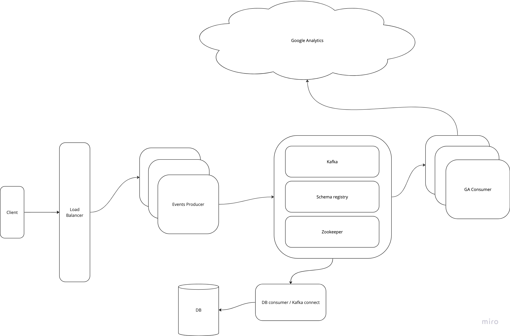

# Server-side Tracking Challenge

[Take-Home Challenge: Server-side Tracking](https://lifi.notion.site/Take-Home-Challenge-Server-side-Tracking-ff85255ee1de446da907b21ee771ad00)

### Demo

Note\* google is sometimes slow to reflect new events

https://github.com/0x6143/jumper.backend/assets/163849755/b8ad8852-22ee-4f05-9d12-2112fefe6120

### Notes

This is just a brain dump of the initial investigations & thoughts throughout the project

- on first glance it looks like [serve side tagging](https://developers.google.com/tag-platform/tag-manager/server-side/intro) might have been a good solution, though given the scope of the project outline and that it still seems susceptible to ad-blockers, I suspect this is not what were looking for here as a solution
- used the measurement protocol api (GA4): https://developers.google.com/analytics/devguides/collection/protocol/ga4
- project outline mentions long term storage, allow for extensibility here
- the requirements do not outline scale so we'll make reasonable assumptions and build towards a scalable solution
- For the MVP, we can start with the exchange/buy/gas buttons as they seem the simplest components to implement
- there’s a number of errors appearing in the console of the UI, difficult to parse new errors without falling into a rabbit hole. will attempt to resolve relevant errors where possible
- there aren’t tests or testing framework set up for the ui
- wallet address is being used as a user identifier, should use a cookie to persist the user id between logins
- Aim is to keep frontend footprint PR small enough whilst still being functionally correct. No premature refactoring or optimisations
- we could decorate the useUserTracking which would give you more events for free but this would require some refactroing which would muddy the PR and intent of the project scope
- we can come back and add timestamps later (we can assume the events are realtime enough for now)
- not all buttons/user actions seem to expose events in the lifi widget - will leave those out of scope

**if I had more time I would (in no particular order):**

- add remaining widget events tracking (It should be very easy to see how we would do this from the code, at leats for the events already exposed by the widget)
- persist wallet address in long-lived cookie for improved tracking
- add service health metrics
- better error handling (proper error types & response codes)
- add more tests including integration tests across the whole stack

### My Contributions

High level outline of what has been built:

[Jumper.exchange](https://github.com/0x6143/jumper.exchange/pull/1):

- added a [new provider](https://github.com/0x6143/jumper.exchange/pull/1/files#diff-1a8f0c97c16d7b887356874717aebe93a845292f4b8ae35c841e090f40a84f6f) to store & manage user info.
- added a [new hook](https://github.com/0x6143/jumper.exchange/pull/1/files#diff-206522c13fbf04996a48d0748b18ceec2ad3bb59b2e57d435b3d418f3ecd4439) which exposes a clean interface for sending events to the backend server.

[Jumper.backend](https://github.com/0x6143/jumper.backend)

- [microservice](https://github.com/0x6143/jumper.backend/blob/main/packages/events-producer) for receiving & producing events to kafka
  - [producer singleton client](https://github.com/0x6143/jumper.backend/blob/main/packages/events-producer/src/services/kafka/producer.ts)
  - [send events to Kafka](https://github.com/0x6143/jumper.backend/blob/main/packages/events-producer/src/controllers/kafkaController.ts)
- [microservice](https://github.com/0x6143/jumper.backend/tree/main/packages/ga-consumer) for consuming events from Kafka and sending to GA
  - [server](https://github.com/0x6143/jumper.backend/blob/main/packages/ga-consumer/src/server.ts)
  - [consume events from Kafka](https://github.com/0x6143/jumper.backend/blob/main/packages/ga-consumer/src/tasks/consumeEvents.ts)
  - [send events to ga](https://github.com/0x6143/jumper.backend/blob/main/packages/ga-consumer/src/services/google-analytics/ga.ts)
- local dev environment with the usual tooling (testing, linting, docker etc.)
  - [local Kafka setup for development](https://github.com/0x6143/jumper.backend/blob/main/docker-compose.kafka.yml)
  - [develop in docker](https://github.com/0x6143/jumper.backend/blob/main/docker-compose.yml)

### RUN

#### Pre-requisites:

you will need to obtain a `GA_MEASUREMENT_ID` & `GA_API_SECRET` from [google analytics](https://developers.google.com/analytics/devguides/collection/protocol/ga4/reference?client_type=gtag#payload_query_parameters) and add them to [./.env.dev](./.env.dev)
All other defaults should work for local development

#### Run

```bash
# run everything in docker, services are brought up synchronously so the first build WILL take a while!
# subsequent builds will still be slower than ideal :D
docker-compose up --build -d # detached mode

# or otherwise run locally, with only kafka services in docker
docker-compose -f docker-compose.kafka.yml up -d
brew install dotenvx/brew/dotenvx
# you should wait for the docker services to be up for a few mins, otherwise you may see some connection errors
yarn dev
```

#### Test

```bash
yarn
yarn lint
yarn test
```

#### Debugging:

```bash
# container/service state
docker-compose ps

# logs
docker-compose logs -f # follow logs of all docker-compose services
docker-compose logs <service-name> -f

# kafka
docker container exec -it kafka /bin/bash # jump into the kafka container
kafka-console-consumer --bootstrap-server localhost:9092 --topic events -from-beginning # consume messages from the events topic
```

## Planning

### Requirements

- Implement server side tracking for the existing jumper.exchange web app
- Events
  - Clicks on exchange/gas/buy buttons
  - Clicks on wallet logo
  - Clicks exposed by li.fi widget
- identify 100% of users (whether or not they're logged in)

### Not in scope

- authentication (backend services etc.)
- deployment/ci/cd
- production build
- production deployment concerns (networking, ssl, auth between services)
- testing of the front end (there are no existing tests there)
- tracking of events that are not already exposed in the Li.Fi widget
- configuring GA further than confirming events are being received

### Expected Challenges

- using google analytics and getting it work, integrating with the API
- familiarising with the jumper codebase
- avoiding rabbit holes

### Architecture

The high level is to impelement a pub/sub based set of services that allows for extensibility and scalabaility.
\*note that some components in the diagram will not be included in the implementation as they’re either purely infrastructure/deployment concerns, trivial to implement or can even leverage off the shelf products (eg. [kafka-connect](https://docs.confluent.io/cloud/current/connectors/cc-postgresql-sink.html) for a data sink to postgres)

For the repo set up we will keep all services in the same repo using simple yarn workspaces config. This just for simplicity so we won't be focusing on any monorepo specific optimisations.



### key technologies

- NodeJS
- Kafka
- Zookeeper
- Schema registry
- Docker

### Work items

Each work item is prefixed with a complexity estimates

| Task                                           | Type          | Deliverable/Acceptance criteria                                                     | Estimate | Priority | Notes                                                                                          |
| ---------------------------------------------- | ------------- | ----------------------------------------------------------------------------------- | -------- | -------- | ---------------------------------------------------------------------------------------------- |
| Familiarise with jumper.exchange codebase      | Investigation | identify what data we have available and where the source of events are             | 2        | P0       | time-box                                                                                       |
| Familiarise with google APIs                   | Investigation | identify what API calls will we need to make and what is the expected shape of data | 2        | P0       | time-box                                                                                       |
| Define high level architecture and choose tech | Documentation | high level archietcture diagram & documented intended technologies                  | 1        | P0       |                                                                                                |
| Draft interfaces & data structures             | Documentation | draft the expected interfaces that the front & backends can be built to             | 1        | P0       | assumption that the frontend already exposes the majority of the data we'll need               |
| MVP                                            | Feature       | front end changes, local kafka, skeleton backend services (producer & GA consumer)  | 5        | P0       | lot's of moving parts, no value delivered if we split this up any further (but it is possible) |
| Acceptance testing                             | Testing       | manually test that the system works as expected (including edge cases if any)       | 2        | P0       | expecting some effort to get GA to play nice, may require some minor code fixes etc.           |
| Clean up any code smells, bugs etc.            | Refactoring   | refactors & fixes to make it easier to maintain & implement the next feature/s      | 2        | P2       | effectively a placeholder in case there are any obvious improvements bugs                      |
| Add remaining events                           | Feature       | integrate reminaing target events                                                   | 3        | P1       | expect at least one event to throw a curveball, plus there are a fair few of them              |
| Track users who aren't logged in               | Feature       | 100% of users are being tracked in GA                                               | 5        | P1       | large unkown of how to track users who are not logged in                                       |
| Acceptance testing                             | Testing       | manually verify that the system works as expected (including edge cases if any)     | 2        | P1       | expecting some effort to get GA to play nice, may require some minor code fixes etc.           |
| Update README                                  | Documentation | README is updated with usage instructions                                           | 1        | P1       |                                                                                                |
| Demo                                           | Documentation | recored a demo                                                                      | 1        | P2       |                                                                                                |
